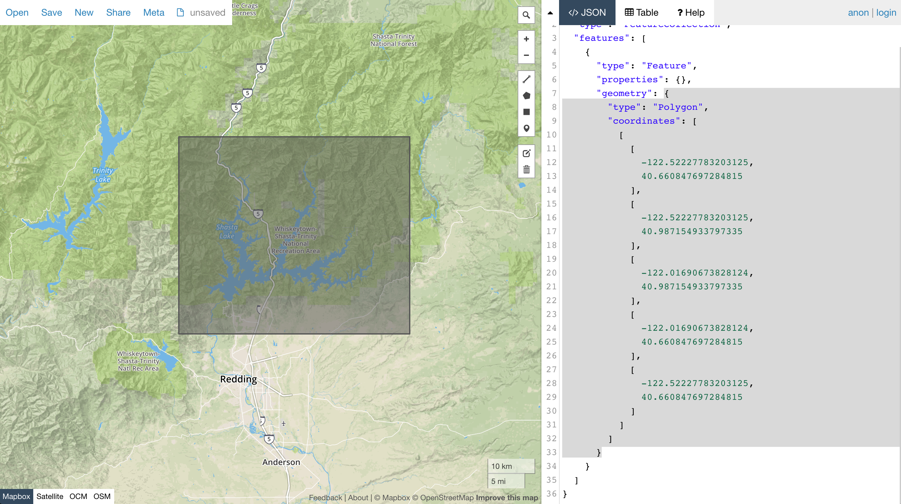
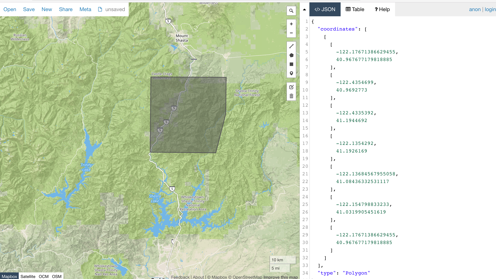

# Planet Labs API v1 Walkthrough, Part 1


* [Development Environment](#devenv)
* [API Access](#api)
* [ItemTypes](#item-types)
* [Find an Area of Interest](#aoi)
* [Search Filters](#search)
* [Stats Endpoint](#stats)
* [Search Endpoint](#search)

This tutorial will walk you through how to search for imagery using the Planet Labs v1 API. 

This guide is all about image metadata. When you're done, see part 2 to learn how to start downloading the actual binary image files.
[Part 2: Activation and Downloading Assets](intro_part_2_activation.md)


<a name="devenv"></a>
## Development Environment

This tutorial primarily uses the following tools:
 
 * Python 2
 * [jq](https://stedolan.github.io/jq/) - a very useful command line tool for maniuplating and displaying JSON.

Most examples pipe the JSON api output to jq and filter for a specific field. You may want to also remove the jq filter to familarize yourelf with the complete API objects.


<a name="api"></a>
## API Access

This tutorial assumes that you have a Planet API key, currently anyone can sign up for a limited access key at [planet.com/products/open-california](https://www.planet.com/products/open-california/). This will give you access to free imagery in California only. (Note, Open California approval is not instantanious)

Once you have an API key, add the key to your shell environment:


```sh
export PLANET_API_KEY=a3a64774d30c4749826b6be445489d3b #(not a real key)
```

<a name="itemtypes"></a>
## ItemTypes
The Planet API brings together different classes of imagery, some classes represent different satellites, some represent different formats, sometimes it's both. Each class of imagery is identified by its "ItemType". 

Examples of ItemTypes are
    
* "PSOrthoTile" - Images taken by PlanetScope satellites in the OrthoTile format.
* "REOrthoTile" - Images taken by RapidEye satellites in the OrthoTile format.

We can see what ItemTypes are avaliable to our API key with our first API query

```sh
➜  curl -L -H "Authorization: api-key $PLANET_API_KEY" \
    'https://api.planet.com/data/v1/item-types' | jq '.item_types[].id'
"REOrthoTile"
"PSOrthoTile"
```

<a name="aoi"></a>
## Select an Area of Interest (AOI)

You can use [geojson.io](http://geojson.io/]) to get geometry coordinates for an area that interests you, start small : ) 

Here's an AOI around a Reservoir near Redding California



The highlighted JSON is a [GeoJSON geometry object](http://geojson.org/geojson-spec.html#geometry-objects) that we can use as a filter in the Planet API.


<a name="filters"></a>
## Filters

Several Planet API endpoints operate on filters, which can be used to narrow down imagery by a variety of attributes like location, cloud coverage %, acquisition date etc.

At this point, it will be easier if we start using Python to interact with the API. The runnable source file for all code snippets will be linked above each snippet.

Let's define some filters

[examples/demo_filters.py](../examples/demo_filters.py)

```python
# the geo json geometry object we got from geojson.io
geo_json_geometry = {
  "type": "Polygon",
  "coordinates": [
    [
      [
        -122.52227783203125,
        40.660847697284815
      ],
      [
        -122.52227783203125,
        40.987154933797335
      ],
      [
        -122.01690673828124,
        40.987154933797335
      ],
      [
        -122.01690673828124,
        40.660847697284815
      ],
      [
        -122.52227783203125,
        40.660847697284815
      ]
    ]
  ]
}

# filter for items the overlap with our chosen geometry
geometry_filter = {
  "type": "GeometryFilter",
  "field_name": "geometry",
  "config": geo_json_geometry
}

# filter images acquired in a certain date range
date_range_filter = {
  "type": "DateRangeFilter",
  "field_name": "acquired",
  "config": {
    "gte": "2016-07-01T00:00:00.000Z",
    "lte": "2016-08-01T00:00:00.000Z"
  }
}

# filter any images which are more than 50% clouds
cloud_cover_filter = {
  "type": "RangeFilter",
  "field_name": "cloud_cover",
  "config": {
    "lte": 0.5
  }
}

# create a filter that combines our geo and date filters
# could also use an "OrFilter"
composed_filter = {
  "type": "AndFilter",
  "config": [geometry_filter, date_range_filter, cloud_cover_filter]
}
```

<a name="stats"></a>
## Stats Endpoint

A good first step would be to use our filter to query the stats endpoint, this will give us a date
bucketed histogram to show us how many items match our filter

[examples/stats_endpoint.py](../examples/stats_endpoint.py)

```python
import requests
from requests.auth import HTTPBasicAuth

# our demo filter that filtrs by geometry, date and cloud cover
from demo_filters import composed_filter

# Stats API request object
stats_endpoint_request = {
  "interval": "day",
  "item_types": ["REOrthoTile"],
  "filter": composed_filter
}

# fire off the POST request
result = \
  requests.post(
    'https://api.planet.com/data/v1/stats',
    auth=HTTPBasicAuth('24c4b3345c38424cb7316b8e971d4286', ''),
    json=stats_endpoint_request)

print result.text
```

Run the script:

```sh
➜ python examples/stats_endpoint.py | jq
{
  "utc_offset": "+0h",
  "interval": "day",
  "buckets": [
    {
      "count": 6,
      "start_time": "2016-07-07T00:00:00.000000Z"
    },
    {
      "count": 9,
      "start_time": "2016-07-13T00:00:00.000000Z"
    },
    {
      "count": 3,
      "start_time": "2016-07-17T00:00:00.000000Z"
    },
    {
      "count": 6,
      "start_time": "2016-07-19T00:00:00.000000Z"
    },
    {
      "count": 6,
      "start_time": "2016-07-22T00:00:00.000000Z"
    }
  ]
}
```


Nice! We can see that in July 2016, RapidEye satellites imaged the area on 5 different days.

<a name="search"></a>
## Search Endpoint

Now let's do a search, this takes the same filter object as the stats endpoint but returns complete metadata objects about the matching items.

[examples/search_endpoint.py](../examples/search_endpoint.py)


```python
import requests
from requests.auth import HTTPBasicAuth

# our demo filter that filtrs by geometry, date and cloud cover
from demo_filters import composed_filter

# Stats API request object
search_endpoint_request = {
  "item_types": ["REOrthoTile"],
  "filter": composed_filter
}

result = \
  requests.post(
    'https://api.planet.com/data/v1/quick-search',
    auth=HTTPBasicAuth('24c4b3345c38424cb7316b8e971d4286', ''),
    json=search_endpoint_request)

print result.text
```

You can use jq to filter the search response down to only item ids

```sh
➜  python examples/search_endpoint.py | jq '.features[].id'
"20160707_195147_1057916_RapidEye-1"
"20160707_195146_1057917_RapidEye-1"
"20160707_195150_1057817_RapidEye-1"
"20160707_195143_1058017_RapidEye-1"
"20160707_195143_1058016_RapidEye-1"
"20160707_195150_1057816_RapidEye-1"
"20160722_194931_1057916_RapidEye-2"
"20160722_194930_1057917_RapidEye-2"
"20160722_194928_1058016_RapidEye-2"
"20160722_194927_1058017_RapidEye-2"
...
```


With some more jq magic, we can grab the 3rd item from our search and display its properties. All of these values can be used in a search filter.


```sh
➜  python examples/search_endpoint.py | jq '.features[3].properties'
{
  "acquired": "2016-07-07T19:51:47Z",
  "anomalous_pixels": 0.05,
  "black_fill": 0,
  "cloud_cover": 0.05,
  "columns": 5000,
  "epsg_code": 32610,
  "grid_cell": "1057916",
  "gsd": 6.5,
  "item_type": "REOrthoTile",
  "origin_x": 523500,
  "origin_y": 4536500,
  "pixel_resolution": 5,
  "provider": "rapideye",
  "published": "2016-08-18T21:26:07Z",
  "rows": 5000,
  "satellite_id": "RapidEye-1",
  "sun_azimuth": 162.95195,
  "sun_elevation": 71.12186,
  "updated": "2016-08-29T04:50:33Z",
  "usable_data": 0.95,
  "view_angle": -13.04192
}
```

### One Weird Trick

[A cli exists](https://github.com/mapbox/geojsonio-cli) to easily send GeoJson geometries to geojson.io

You can use jq to extract the geometry coordinates of a specific item from the search results and pipe it into the geojsonio tool

```sh
python examples/search_endpoint.py | jq '.features[3].geometry' | geojsonio
```

This visualizes the footprint of the 3rd item in the search



###Next section: [Activating and Downloading Assets](intro_part_2_activation.md)
