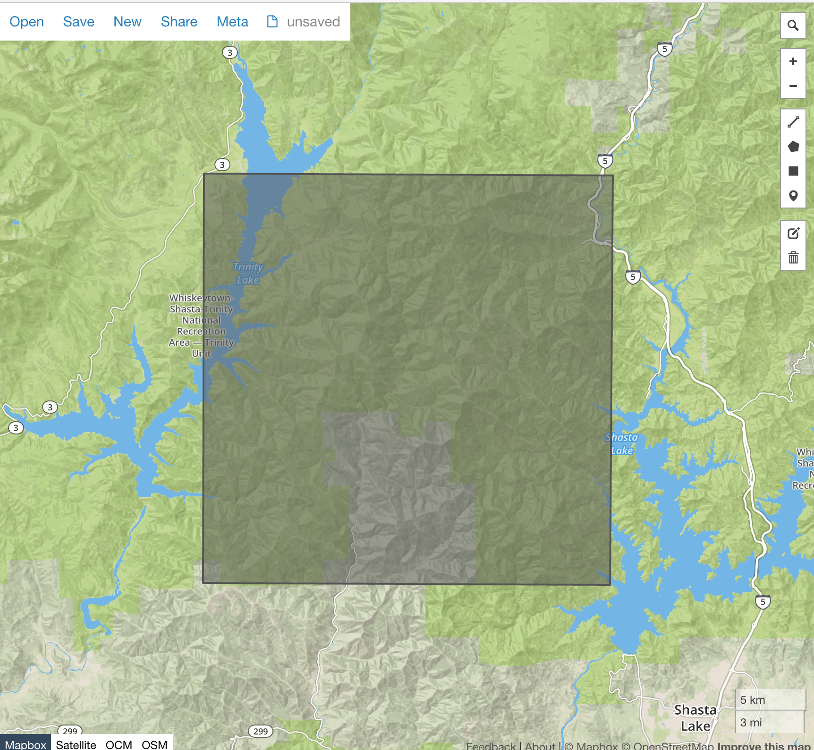

# Planet Labs API v1 Walkthrough, Part 2

See [part 1](intro_part_1_search.md) for instructions on using this guide and acquiring a Planet Labs API key.

This guide will walk you through some best practices for downloading your image files.


## Recap
In the last section, we learned how to search for items that interest us. 

Items are identified by their ItemType and ItemId, here is one of the items from our part 1 search.

```
ItemType: REOrthoTile
ItemId: 20160707_195147_1057916_RapidEye-1
```

An easy way to visualize this item before we download it would be extract it's geometry coordinates and view it's footprint in geojson.io

```sh
curl -L -H "Authorization: api-key $PLANET_API_KEY" \
    'https://api.planet.com/data/v1/item-types/REOrthoTile/items/20160707_195147_1057916_RapidEye-1' \
    | jq '.geometry' | geojsonio
```




## Assets

In general, a single satellite image can be provided in many different formats for different use cases. Some users might want color corrected products that can be viewed on the web, some might want raw image data for scientific purposes.

In the Planet API, these different item options are called Assets and items usually have multiple assets.

Let's see what assets are availiable 


 


